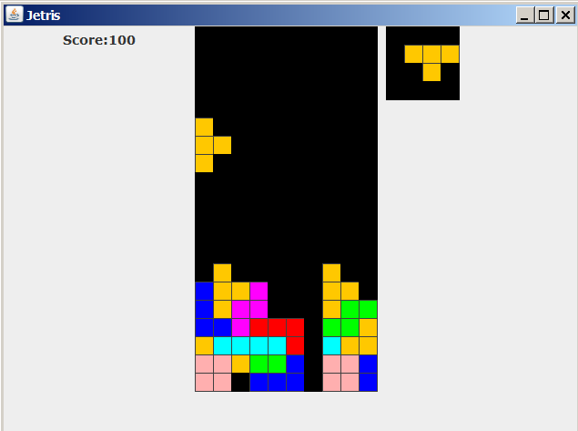
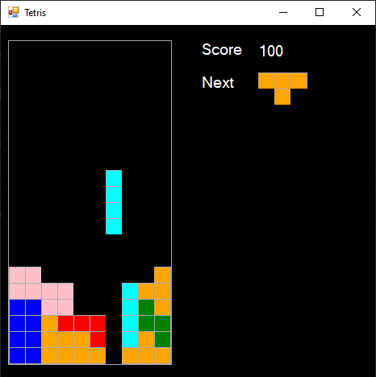
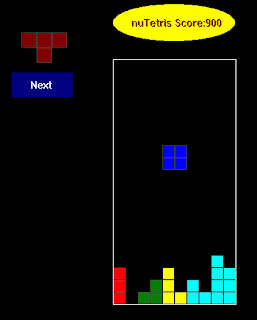
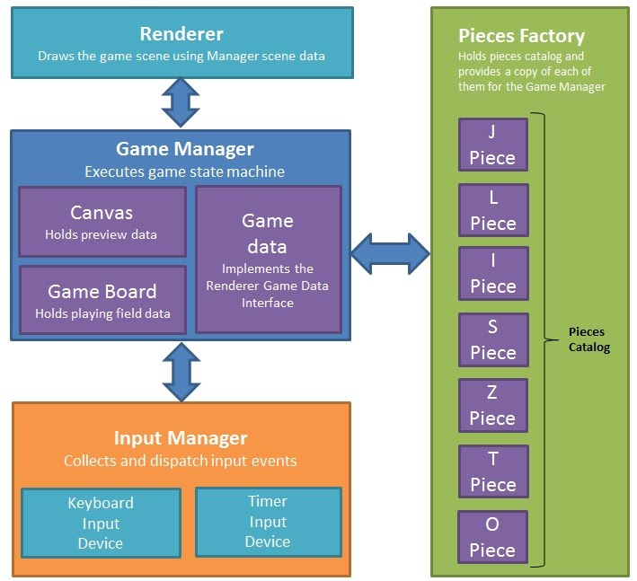

# nutetris
Tetris game clone written in c++11 and ported in Java, C# and BASIC (for nuBASIC interpreter).

## Why nuTetris?
nuTetris is a good sample of not trivial application which can be used as example in a programming training course.
It has been designed mainly for educational purposes for developers that can deal with a non-trivial example of object-oriented design, which relies on effective modern techniques for producing modular and reusable and multi-platform code.

## The game components
- Game manager 
  - Builds other game components 
  - Gets any input event from Input Manager 
  - Executes the game state machine 
  - Calls the Renderer in order to draw the game scene 
  - Canvas and Game Board are instance of Grid class, which manages the interactions of piece and board. 
    It is also used to represent the piece canvas which shows a preview of next falling piece.
  - Game data object holds information passed to the Renderer which use them to draw the scene
  

- Renderer
  - Interface for the game scene renderer.
  - At compile time is selected one of the following renderer implementations: 
  - Text Renderer (is a Renderer) 
  - Renders the game scene using ASCII art graphics 
  - GDI Renderer (is a Renderer) relies on GUI (tetris::gui_t) which provides an Adapter for Linux (X11) and Windows implementations
  
- Piece Factory
  - Creates each Tetris Piece instance needed by Game Manager 
  
- Tetris Piece
  - Holds piece shape information
  
- Input Manager 
  - Manages the input devices (Keyboard, Timers).
  Used by Game Manager to collect any user and timer events 
  
- Input Device (c++ implementation only)
  - Interface implemented by the actual input devices 
  
- Keyboard Input Device is an Input Device (c++ implementation only) 
  - Read and process the keyboard events
 
